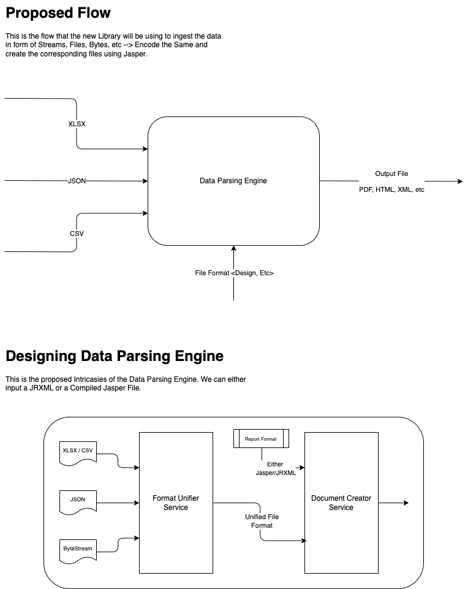

# Unified Data Parser and Report Generator

This project provides a **pluggable**, **extensible**, and **framework-agnostic** solution to convert structured input data formats like **XLSX**, **CSV**, **JSON**, and **ByteStream** into a **Unified Data Format**, which can then be used to generate reports in **PDF**, **HTML**, or **XML** using **JasperReports** or similar tools.


### 📦 Package & Build Status

[](https://github.com/docflex/UnifiedReporter/packages)


[](https://github.com/docflex/UnifiedReporter/actions/workflows/build.yml)


## Architecture Overview

### 🔁 Data Flow



1. Input Formats Supported:

    * XLSX
    * CSV
    * JSON
    * ByteStream

2. These are parsed by individual format handlers (e.g., `XLSXFormat`, `CSVFormat`, etc.).

3. Data is converted into a **Unified Format**:
   `List<Map<String, Object>>` where each `Map` is a row.

4. Passed to a **Document Creator Service** (e.g., using JasperReports) with optional template configuration (JRXML).

---

### 🧱 Component Design


---

## 🧰 Features

* ✅ Support for multiple structured input formats
* ✅ Converts inputs to a normalized unified structure
* ✅ Validates fields and data integrity
* ✅ Extensible via SPI or Spring DI
* ✅ Descriptive error handling with custom error codes
* ✅ Log integration with SLF4J
* ✅ Can be used as:

    * **A Library (Embedded)**
    * **A Microservice (RESTful API)**

---

## 🏗 Project Modules

| Module             | Purpose                                       |
| ------------------ | --------------------------------------------- |
| `formats`          | Parsers for CSV, XLSX, JSON, ByteStream       |
| `common`           | Error codes, exceptions, and utility classes  |
| `jasper-engine`    | Report rendering using JasperReports          |
| `unified-core`     | Interface `UnifiedFormat`, data normalization |
| `document-creator` | Consumes unified format to generate reports   |

---

## 🧪 How to Use

### ✅ As a **Library**

```java
try (InputStream is = new FileInputStream("/path/to/file.xlsx")) {
    UnifiedFormat format = new XLSXFormat(is, "MySource");
    List<Map<String, Object>> data = format.getDataRows();
    
    // pass to Jasper engine or use for validation
    documentCreator.generatePdf(data, templatePath);
}
```

### ✅ As a **Spring Service**

1. Annotate format classes like `@Component`
2. Inject them via Spring DI where needed
3. Define `@RestController` to expose input and output endpoints

---

## 📦 Usage Pattern

### `UnifiedFormat` Interface

```java
public interface UnifiedFormat {
    List<Map<String, Object>> getDataRows();
    default List<String> getColumnOrder() { return null; }
    default String getSourceName() { return "unnamed"; }
    default void validateFields(List<String> requiredColumns) throws FormatException;
}
```

---

## 🚨 Error Handling

All errors use a centralized `ErrorCode` enum with detailed messages and status codes:

```java
public enum ErrorCode {
    XLSX_PARSE_ERROR("XLSX_001", "Failed to read Excel file", HttpStatus.BAD_REQUEST),
    CSV_PARSE_ERROR("CSV_001", "Invalid CSV Format", HttpStatus.BAD_REQUEST),
    ...
}
```

Use it in custom exceptions like:

```java
throw new FormatException(ErrorCode.XLSX_PARSE_ERROR, e);
```

---

## ✅ Testing

Unit tests are written using **JUnit 5** with in-memory test files for:

* Valid XLSX parsing
* Missing headers
* Mismatched rows
* Fallback source name
* Field validation

```java
@Test
void testValidXlsxParsing() {
    InputStream inputStream = getClass().getResourceAsStream("/valid.xlsx");
    XLSXFormat parser = new XLSXFormat(inputStream, "ValidXLSX");

    List<Map<String, Object>> rows = parser.getDataRows();
    assertEquals(2, rows.size());
}
```

---

## 🔧 Fluent Builders (Optional)

If required, you can introduce fluent builders for complex configuration like:

```java
UnifiedFormat format = XLSXFormat.builder()
    .withInputStream(stream)
    .withSourceName("Sheet1")
    .build();
```

---

## 📝 To Do

* [ ] Add REST API support
* [ ] Support XML input
* [ ] Upload file via UI for demo
* [ ] Advanced field validation schema
* [ ] Column-wise type inference
* [ ] Asynchronous report generation

---

## 💬 Contribution

Pull requests are welcome! Please include:

* Relevant unit tests
* Meaningful commit messages
* Clean error handling

---

## 📄 License

MIT License — use it freely with attribution.


