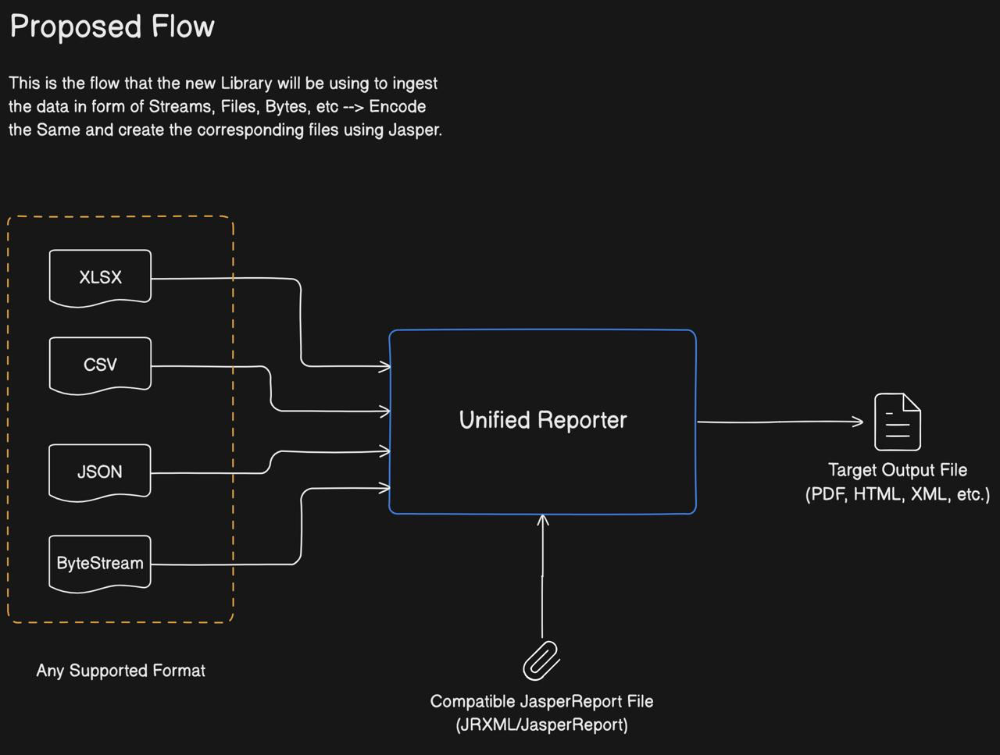
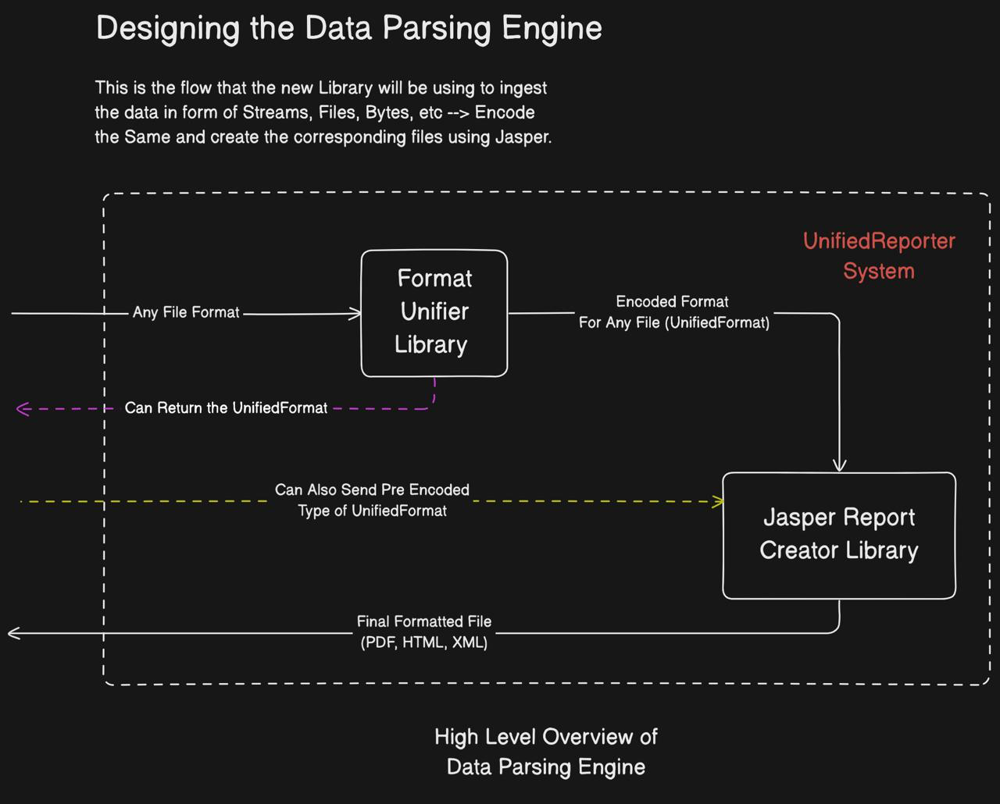

# Unified Data Parser and Report Generator

This project provides a **pluggable**, **extensible**, and **framework-agnostic** solution to convert structured input
data formats like **XLSX**, **CSV**, **JSON**, and **ByteStream** into a **Unified Data Format**, which can then be used
to generate reports in **PDF**, **HTML**, or **XML** using **JasperReports** or similar tools.

### 📦 Build & Release Status

[](https://github.com/docflex/UnifiedReporter/actions/workflows/build.yml)

[](https://github.com/docflex/UnifiedReporter/releases)

## Architecture Overview

### 🔁 Proposed Flow & Design



1. Input Formats Supported:

    * XLSX
    * CSV
    * JSON
    * ByteStream

2. These are parsed by individual format handlers (e.g., `XLSXFormat`, `CSVFormat`, etc.).

3. Data is converted into a **Unified Format**:
   `List<Map<String, Object>>` where each `Map` is a row.

4. Passed to a **Document Creator Service** (e.g., using JasperReports) with optional template configuration (JRXML).

---

## 🧪 How to Use

### ✅ As a **Library**

```java
try (InputStream is = new FileInputStream("/path/to/file.xlsx");
InputStream jrxmlTemplate = getClass().getResourceAsStream("/template.jrxml")) {

// Wrap your data
UnifiedFormat format = new XLSXFormat(is, "Sheet1");

// Define optional parameters
Map<String, Object> params = Map.of("ReportTitle", "My Excel Report");

// Generate PDF report
byte[] report = ReportGenerator.generateReport(
        format,
        jrxmlTemplate,
        params,
        FileExportFormat.PDF
);

// Save to file or return as HTTP response
}
```

---

### ✅ As a **Spring Service**

1. Define a REST controller:

   ```java
   @RestController
   @RequestMapping("/reports")
   public class ReportController {

       @PostMapping(value = "/xlsx", consumes = MediaType.MULTIPART_FORM_DATA_VALUE)
       public ResponseEntity<byte[]> generateReport(
               @RequestParam MultipartFile file
       ) throws IOException {
           try (InputStream is = file.getInputStream();
                InputStream template = getClass().getResourceAsStream("/template.jrxml")) {

               XLSXFormat input = new XLSXFormat(is, "Sheet1");

               byte[] report = ReportGenerator.generateReport(
                       input,
                       template,
                       Map.of(),
                       FileExportFormat.PDF
               );

               return ResponseEntity.ok()
                       .header(HttpHeaders.CONTENT_DISPOSITION, "attachment; filename=report.pdf")
                       .body(report);
           }
       }
   }
   ```

2. Inject format classes as needed (no annotation required unless manually registering):

    * The `XLSXFormat` or `CSVFormat` classes can be instantiated directly.
    * No Spring annotations are required unless wrapping them in a custom service or bean.
---


### 🧱 Component Design



---

## 🧰 Features

* ✅ Support for multiple structured input formats
* ✅ Converts inputs to a normalized unified structure
* ✅ Validates fields and data integrity
* ✅ Extensible via SPI or Spring DI
* ✅ Descriptive error handling with custom error codes
* ✅ Log integration with SLF4J
* ✅ Can be used as:

    * **A Library (Embedded)**
    * **A Microservice (RESTful API)**

---

## 🏗 Project Modules

| Module             | Purpose                                       |
|--------------------|-----------------------------------------------|
| `formats`          | Parsers for CSV, XLSX, JSON, ByteStream       |
| `common`           | Error codes, exceptions, and utility classes  |
| `jasper-engine`    | Report rendering using JasperReports          |
| `unified-core`     | Interface `UnifiedFormat`, data normalization |
| `document-creator` | Consumes unified format to generate reports   |

---

## 📦 Usage Pattern

### `UnifiedFormat` Interface

```java
public interface UnifiedFormat {
    List<Map<String, Object>> getDataRows();

    default List<String> getColumnOrder() {
        return null;
    }

    default String getSourceName() {
        return "unnamed";
    }

    default void validateFields(List<String> requiredColumns) throws FormatException;
}
```

---

## 🚨 Error Handling

All errors use a centralized `ErrorCode` enum with detailed messages and status codes:

```java
public enum ErrorCode {
    XLSX_PARSE_ERROR("XLSX_001", "Failed to read Excel file", HttpStatus.BAD_REQUEST),
    CSV_PARSE_ERROR("CSV_001", "Invalid CSV Format", HttpStatus.BAD_REQUEST),
    ...
}
```

Use it in custom exceptions like:

```java
throw new FormatException(ErrorCode.XLSX_PARSE_ERROR, e);
```

---

## ✅ Testing

Unit tests are written using **JUnit 5** with in-memory test files for:

* Valid XLSX parsing
* Missing headers
* Mismatched rows
* Fallback source name
* Field validation

```java

@Test
void testValidXlsxParsing() {
    InputStream inputStream = getClass().getResourceAsStream("/valid.xlsx");
    XLSXFormat parser = new XLSXFormat(inputStream, "ValidXLSX");

    List<Map<String, Object>> rows = parser.getDataRows();
    assertEquals(2, rows.size());
}
```

---

## 🔧 Fluent Builders (Optional)

If required, you can introduce fluent builders for complex configuration like:

```java
UnifiedFormat format = XLSXFormat.builder()
        .withInputStream(stream)
        .withSourceName("Sheet1")
        .build();
```

---

## 📝 To Do

* [ ] Add REST API support
* [ ] Support XML input
* [ ] Upload file via UI for demo
* [ ] Advanced field validation schema
* [ ] Column-wise type inference
* [ ] Asynchronous report generation

---

## 💬 Contribution

Pull requests are welcome! Please include:

* Relevant unit tests
* Meaningful commit messages
* Clean error handling

---

## 📄 License

This project is licensed under the [MIT License](LICENSE).
